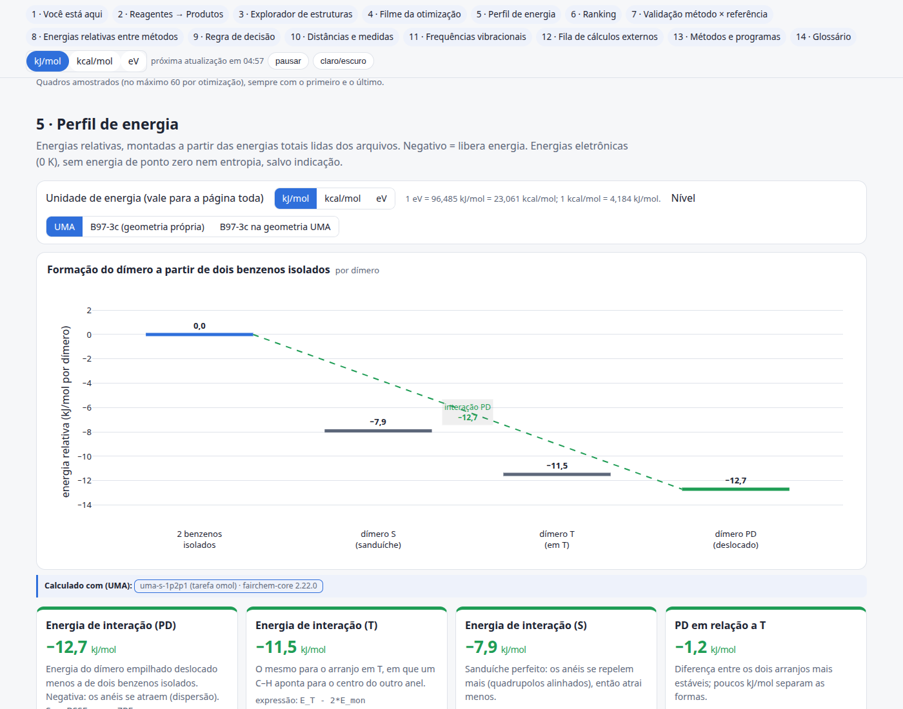
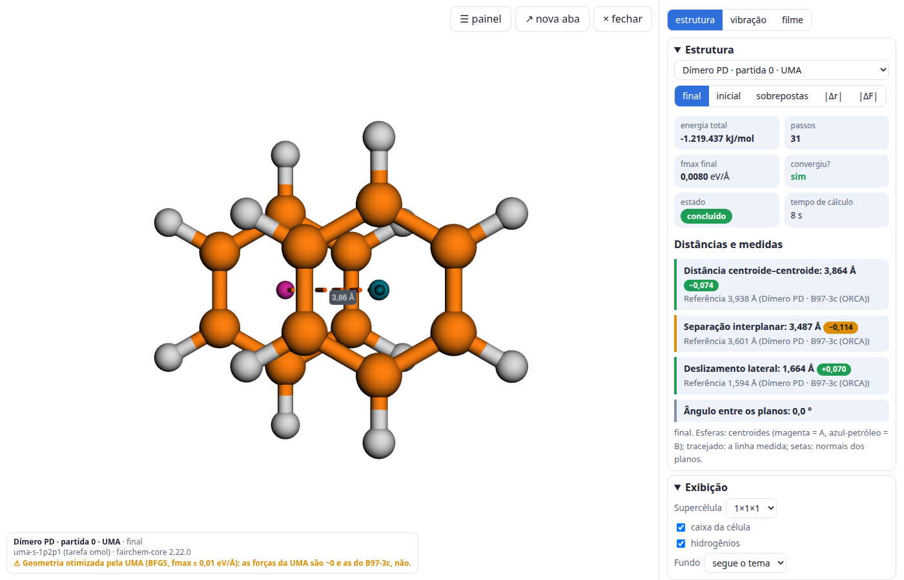
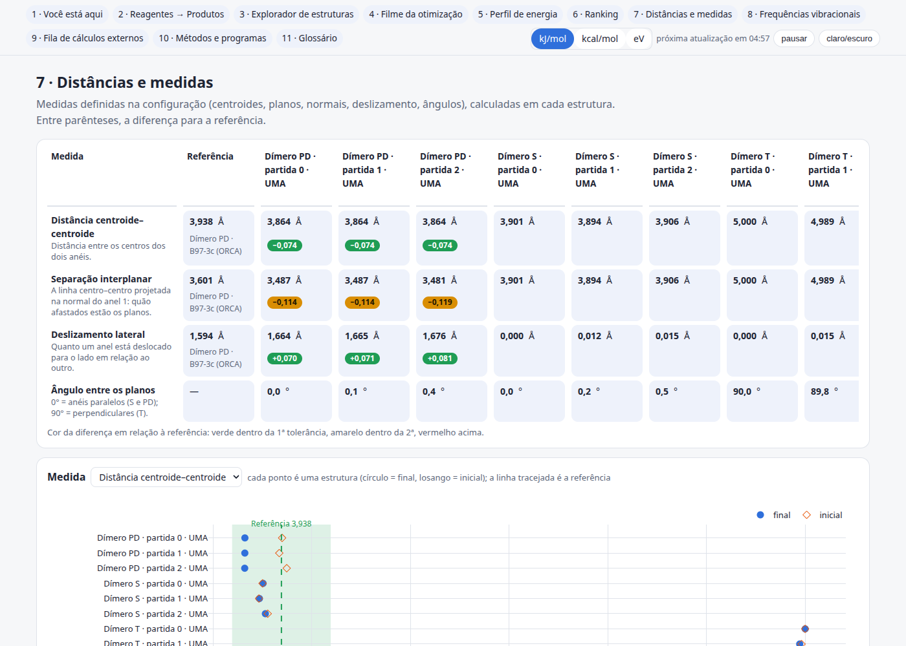
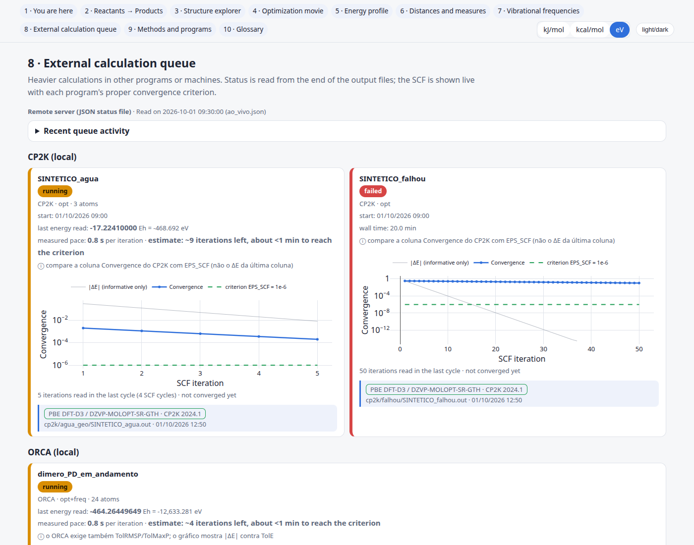
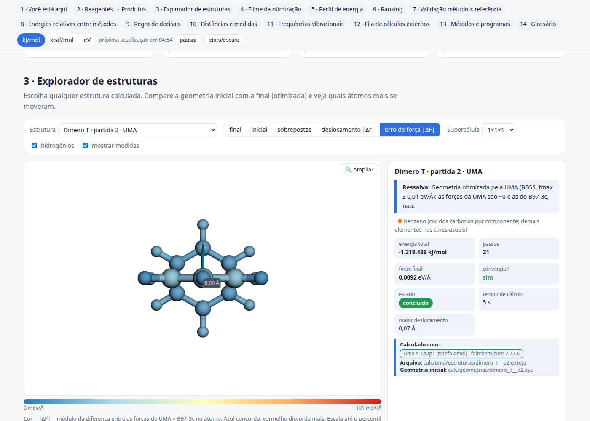
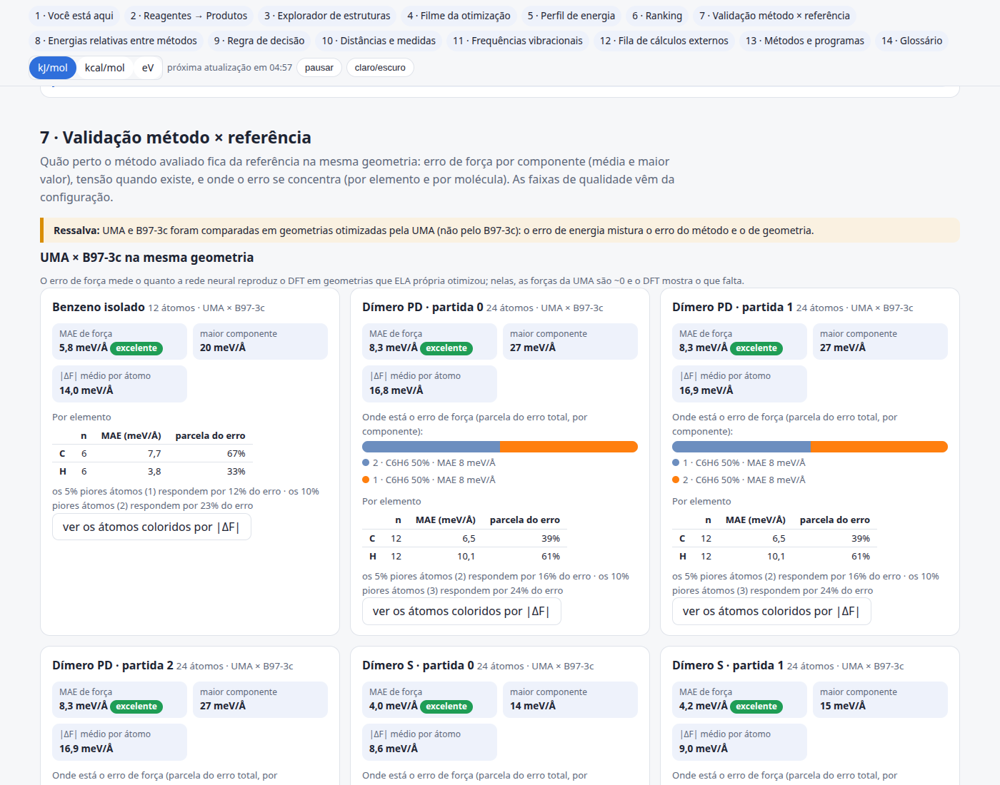
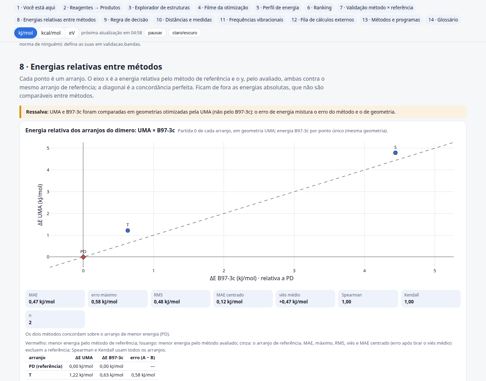
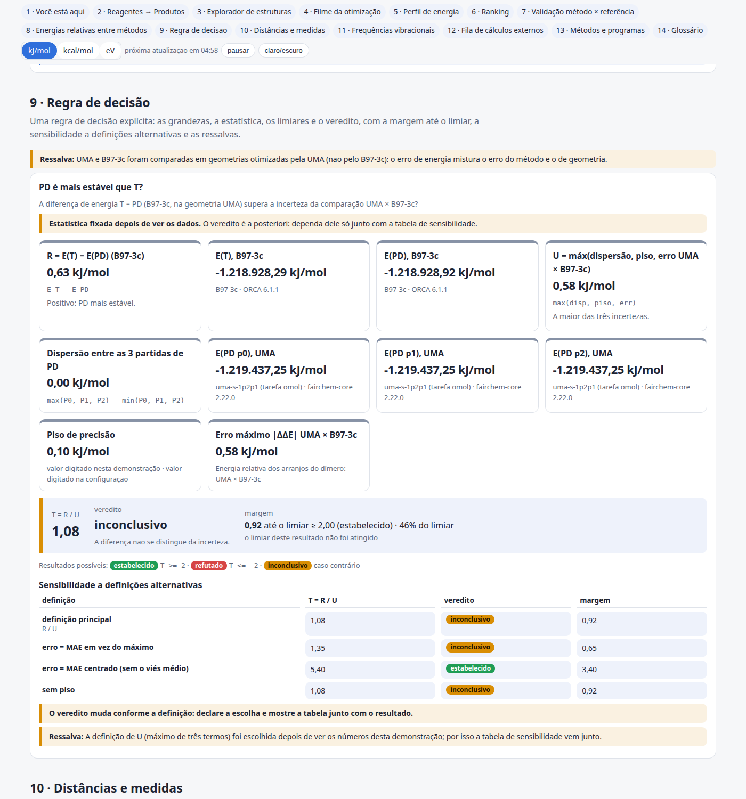
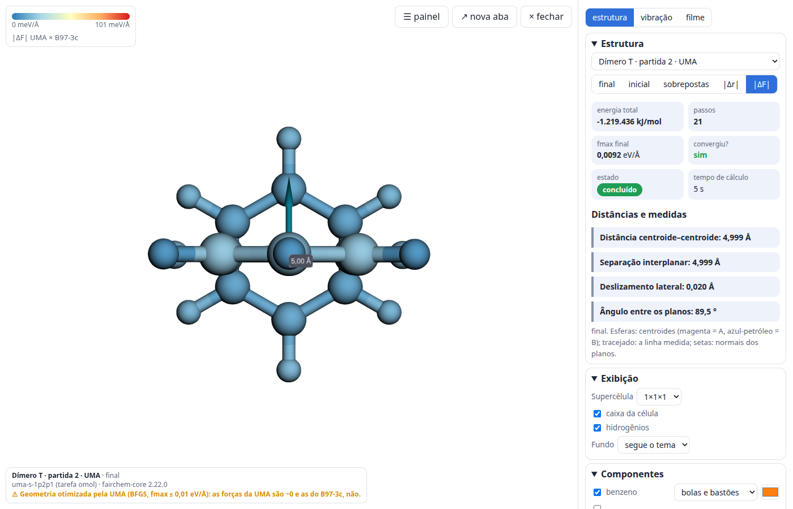

# CalcBoard

Skill do [Claude Code](https://claude.com/claude-code) que transforma as saídas de cálculos de estrutura eletrônica e
simulação atomística (moléculas, cristais, superfícies, aglomerados) num **painel HTML único, offline, interativo e
didático**. Também funciona sozinha, como script Python, sem o Claude.



> *English summary at the end.*

## O que o painel mostra

Cada seção só aparece se houver dado para ela.

| Seção | Conteúdo |
|---|---|
| 1 · Você está aqui | Etapas do trabalho com estado (concluído / rodando / pendente / falhou), setas de dependência, contagem feito/total e ETA quando há ritmo medido |
| 2 · Reagentes → Produtos | Visualizadores 3D lado a lado, célula e supercélula, energia, passos, convergência, selo do nível |
| 3 · Explorador | Qualquer estrutura: inicial, final, sobrepostas, colorida por \|Δr\| ou, quando há dois métodos no mesmo ponto, pelo **erro de força por átomo \|ΔF\|** (barra em meV/Å) |
| 4 · Filme da otimização | Quadro a quadro em 3D + energia, fmax e σ × passo |
| 5 · Perfil de energia | Diagrama de níveis / ciclo definido por somas de termos, ou perfil R → TS → P; parcelas com explicação; comparação entre níveis de cálculo |
| 6 · Ranking | Confôrmeros / microestados ordenados, com dispersão entre réplicas |
| 7 · Validação método × referência | Por sistema: MAE e maior componente de força, tensão, onde está o erro (por elemento e molécula/componente, e a fração do erro nos k% piores átomos), com **faixas de qualidade definidas por você** |
| 8 · Energias relativas entre métodos | Dispersão ΔE do método A × ΔE do método B contra um arranjo de referência, diagonal, MAE / máx / RMS / MAE centrado, Spearman e Kendall, e aviso quando os métodos **discordam sobre o arranjo mais estável** |
| 9 · Regra de decisão | Cartão genérico: grandezas, estatística, resultados possíveis (estabelecido / refutado / inconclusivo ou os seus), **veredito com margem** até o limiar, tabela de **sensibilidade** a definições alternativas e ressalvas |
| 10 · Distâncias e medidas | Centroides, planos, normais, deslizamento, ângulos; comparação com referência e tolerâncias |
| 11 · Frequências vibracionais | Espectro de linhas, modos animados, ZPE, validação contra referência, comparação MLIP × DFT |
| 12 · Fila de cálculos externos | Estado dos jobs e convergência do SCF ao vivo (com o critério certo do programa) |
| 13 · Métodos e programas | Nível, programa, versão, critérios — lidos dos arquivos |
| 14 · Glossário | Termos em linguagem simples |

Em todo o painel:

- **kJ/mol | kcal/mol | eV**: seletor global, a escolha fica salva no navegador.
- **Selo de nível de cálculo + programa/versão** em todo resultado, lido dos arquivos. Se o arquivo não registra,
  aparece "não registrado" (ou "declarado na configuração", quando você informa). Nunca é inventado.
- **🔍 Ampliar** (tela cheia): medidas por clique (distância, ângulo, diedro), isolar região, estilos por componente,
  contatos, vistas, modos vibracionais, filme, exportar PNG / xyz / cif, e link direto `painel.html#zoom=<id>`.
- **Ressalvas** (limitações conhecidas) como faixas coloridas por seção, por estrutura ou por resultado, também na etiqueta
  do 🔍 Ampliar.
- **Recarga automática** a cada `recarga_s` segundos, adiada enquanto o Ampliar está aberto ou houve uso recente,
  com contador e botão de pausa.
- Tema claro/escuro; textos em português (padrão) ou inglês (`lang: en`).
- **Um único arquivo HTML**, offline: 3Dmol.js 2.4.0 e plotly.js 4.0.0 vão embutidos (de `assets/vendor/`).
- **Somente leitura**: o painel nunca altera os resultados. Um leitor que falha vira aviso no painel; a geração não
  quebra.

| Ampliar | Medidas | Fila com SCF ao vivo |
|---|---|---|
|  |  |  |

| Erro de força \|ΔF\| (Explorador) | Validação método × referência | Energias relativas |
|---|---|---|
|  |  |  |

| Regra de decisão com sensibilidade e ressalvas | Ampliar em modo \|ΔF\| (a ressalva vai na etiqueta) |
|---|---|
|  |  |

## Programas lidos

| Programa / formato | O que é extraído |
|---|---|
| ORCA (`.out`, `_trj.xyz`, `.hess`) | energia, geometria, otimização passo a passo, frequências e modos, nível, versão, estado |
| CP2K (`.out`, `-pos-1.xyz`, `-VIBRATIONS-1.mol`) | SCF com a coluna de convergência (ao vivo), energia, trajetória, frequências |
| VASP (`OUTCAR`, `vasprun.xml`, `OSZICAR`) | energias, geometrias, célula, forças, tensões |
| Gaussian (`.log`) | otimização, frequências, nível |
| Quantum ESPRESSO (`pw.x` `.out`) | relax / vc-relax, energias, célula |
| ASE (extxyz, traj, cif, POSCAR/CONTCAR, xyz) | geometria, célula, energia/forças/tensão quando presentes |

Forças por átomo (para o erro de força) vêm de ORCA (`CARTESIAN GRADIENT` / `.engrad`), ASE, VASP, CP2K e Gaussian (`NoSymm`), ou de um JSON por átomo.

| JSON / JSONL | progresso de otimização por passo, frequências, registros, fila ao vivo |

Detalhes e limitações: [`calcboard/references/leitores.md`](calcboard/references/leitores.md).
ORCA e ASE foram testados com saídas reais (exemplo do dímero de benzeno); CP2K, VASP, Gaussian e QE com amostras
sintéticas curtas (`examples/amostras/`, recriadas por `gerar_amostras.py`).

## Instalação

```bash
git clone https://github.com/fatioleg/CalcBoard.git
cp -r CalcBoard/calcboard ~/.claude/skills/        # a skill é a pasta calcboard/ interna
pip install numpy ase pyyaml                                   # ase: formatos ASE; pyyaml: configuração .yaml
pip install playwright && playwright install chromium          # opcional: conferência por captura headless
```

No Claude Code, peça por exemplo *"faça um painel dos cálculos desta pasta"* ou *"calculation dashboard for these
runs"*. A skill descobre as saídas, escreve a configuração, gera o HTML e confere por captura.

## Uso direto

```bash
S=~/.claude/skills/calcboard/scripts
python $S/painel.py descobrir minha_pasta -o painel.yaml   # rascunho de configuração a partir das saídas
python $S/painel.py ler calc/opt.out                       # diagnóstico: o que o leitor extrai do arquivo
python $S/painel.py init                                   # modelo comentado de painel.yaml
python $S/painel.py gerar painel.yaml                      # gera painel.html
python $S/painel.py gerar painel.yaml --vigiar 120         # regenera a cada 120 s (cálculos rodando)
python $S/captura.py painel.html -o p.png                  # captura headless; código 0 = sem erros de JavaScript
python $S/captura.py painel.html -o z.png --hash "#zoom=<id>"   # abre direto no modo Ampliar
```

Configuração mínima:

```yaml
titulo: "Painel dos cálculos — meu projeto"
unidade: kJ/mol
estruturas:
  - {id: R, arquivo: calc/R/opt.out, papel: reagente}
  - {id: P, arquivo: calc/P/opt.out, papel: produto}
energia:
  termos: {E_R: R, E_P: P}
  parcelas:
    - {nome: "Energia de reação", expr: "E_P - E_R", explicacao: "Negativa: a reação libera energia."}
```

Todas as chaves: [`references/formato-config.md`](calcboard/references/formato-config.md) ·
estrutura comum dos dados: [`references/formato-dados.md`](calcboard/references/formato-dados.md) ·
boas práticas (comparar métodos na mesma geometria, rotular o exploratório, critério de convergência por programa):
[`references/boas-praticas.md`](calcboard/references/boas-praticas.md).

## Exemplos

- [`examples/dimero_benzeno/`](examples/dimero_benzeno/) — sistema público e trivial com **dados reais**: monômeros de
  benzeno → dímeros S, T e PD (3 partidas cada), otimizados com UMA (fairchem) com trajetória e progresso; frequências
  UMA; ORCA 6 B97-3c (Opt Freq) e B97-3c **com gradiente na geometria do UMA** (10 pontos): é daí que saem o erro de
  força por átomo, a validação, a energia relativa dos arranjos e uma regra de decisão de demonstração com ressalvas.
  `gerar_dados.py` refaz tudo. Abra
  [`painel.html`](examples/dimero_benzeno/painel.html).
- [`examples/amostras/`](examples/amostras/) — saídas sintéticas curtas de ORCA (em andamento), CP2K (concluído e
  com SCF que não convergiu), VASP, Gaussian, QE e um JSON de fila ao vivo; `gerar_amostras.py` as recria.

## Testes

```bash
python -m pytest tests/      # ou: python -m unittest discover tests
```

Leitores (real e sintético), geração do painel, robustez (arquivos vazios, binários, truncados, sem permissão,
configuração com erros), forças/validação/energia relativa/regra de decisão/ressalvas (controles positivos e
negativos), paridade pt/en das mensagens e navegador headless (sem erros de JavaScript; modo Ampliar por `#zoom=`; modo
\|ΔF\|; troca de unidade).
Os testes de navegador são pulados se não houver Playwright/Chromium.

## Estrutura do repositório

```
calcboard/            a skill (copie esta pasta para ~/.claude/skills/)
  SKILL.md                  gatilhos e fluxo para o Claude
  scripts/painel.py         CLI: gerar, descobrir, ler, init
  scripts/captura.py        conferência headless
  scripts/painel_lib/       leitores, geometria, montagem dos dados, textos PT/EN
  assets/                   template HTML, modelo de configuração, vendor/ (3Dmol.js, plotly.js e licenças)
  references/               formato da configuração e dos dados, leitores, boas práticas
examples/                   dímero de benzeno (real) e amostras sintéticas
tests/                      pytest / unittest
docs/                       capturas de tela
```

## Licença

Apache-2.0 ([LICENSE](LICENSE)). 3Dmol.js (BSD-3-Clause) e plotly.js (MIT) são redistribuídos com suas licenças em
`calcboard/assets/vendor/`.

---

## English summary

**CalcBoard** is a Claude Code skill (and standalone Python tool) that turns electronic-structure / atomistic
simulation outputs into a **single, offline, interactive HTML dashboard**. It reads ORCA, CP2K, VASP, Gaussian,
Quantum ESPRESSO, ASE formats (extxyz, traj, cif, POSCAR, xyz) and generic JSON/JSONL, driven by a small YAML/JSON
configuration. Sections (shown only when there is data): workflow status with dependencies and ETA, reactants →
products in 3D, structure explorer (initial/final/overlay/|Δr|), optimization movie with energy/fmax/stress plots,
energy level diagrams or reaction profiles built from sums of terms, conformer ranking, configurable geometric
measures, vibrational spectra with animated modes and validation against references, external job queue with live
SCF convergence, methods and glossary — plus a **method × reference validation** block (per-atom force error shown on
the 3D structures, force/stress MAE by user-defined quality bands, error share by element and molecule), **relative
energies across conformers** for two methods (parity plot, MAE/RMS/centred MAE, Spearman/Kendall, a flag when the methods
disagree on the most stable one), a generic **decision-rule card** (verdict, margin to the threshold, sensitivity to
alternative definitions) and **caveat banners** attachable to any section, structure or result. A global **kJ/mol | kcal/mol | eV** switch, a **level-of-theory + software
version badge on every result** (read from files, never invented), a full-screen **🔍 Zoom** mode (click measurements,
region isolation, exports, `#zoom=` deep links), auto-reload, light/dark theme, and Portuguese or English text
(`lang: en`). The dashboard is read-only and a failing reader becomes a warning, never a crash.

```bash
cp -r CalcBoard/calcboard ~/.claude/skills/
python ~/.claude/skills/calcboard/scripts/painel.py descobrir my_runs -o painel.yaml
python ~/.claude/skills/calcboard/scripts/painel.py gerar painel.yaml
```

Licensed under Apache-2.0.
